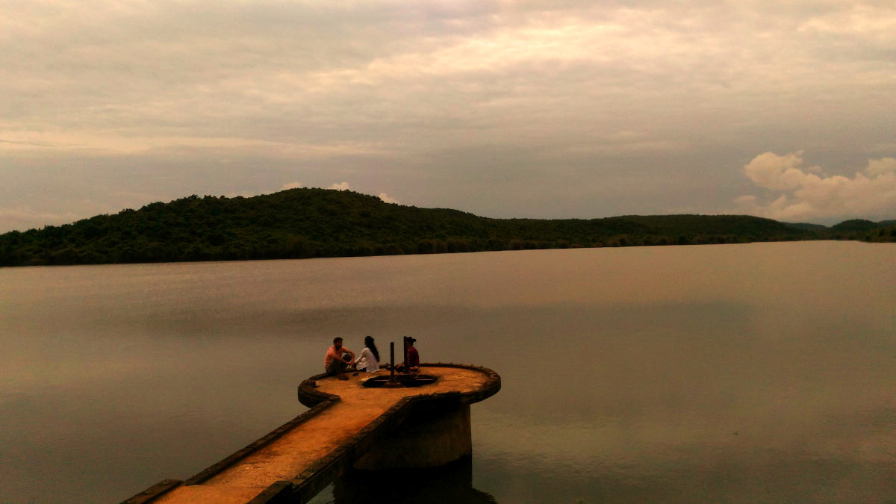

Happy new year! I am late about the post. But can not miss it. The reflection about the past year. 

It was a year of breaking many things. The list will be very long to write and some of the things can not even be put in words. These are both internal and external. 

[//]: # (I can see this started with [November 2018][iy-1].)

> A complete new life in the making now.

From outside it may seem the same but from inside I can see this. There were people arround me who seem to be wondering as to, what and how I am doing life. That is alright.

The first hand experience of court and lawyers was an eye opening as to "what is it, really?!" As it is said, one can only understand if got an experience. Knowing from outside and knowing from experience is a big difference.

The year opened it all. The people who stand by me and the people who just pretend, are out in the open. It just amazes to see how people react, even if one does not do anything after knowing the facts.

Worked in Architecure after a long time. Thanking all those, who gave me a chance to do it.

Pitching for a startup, raising funds and group activity with new people for social cause brought in a whole new experience in itself.

My fund raising expereince [part 1][fund-1], [part 2][fund-2]. 🙏 The campaigns are open and you still can donate.

> Make room for new. New can only come in, if you do break the old. Old thoughts and habits are a dead-end.

That is very true. A whole new experience has started coming in, once I gave it a chance. Help came in from all directions, except from where and how I expected! But that is the beauty of life. Once one is open to it, one can get.

> The "new" overwhelmed me so much, that I got out of the "old" effortlessly.

There were tears with people whom I never thought I would talk to. There were smiles with people who are completly strangers. There were activity all around the year, yet I was home all the time. Some were thinking I was doing nothing sitting at home, at the same time there were people who thought "how are you doing all this?!". That is fascinating to see. I have visited so many places, some alone and some with friends. Met a lot of new people and interacted with them. A lot of bike ride, in and arround the city. There was cyclone and the city devastated. I went through that with ease. No electricity, very little water for alomst more than a month.

It gave me a foundation to build upon. 

Happy living. 

[s1]: https://saumya.github.io/ray/articles/87/

[fund-1]: ../86/
[fund-2]: ../86/2.html

[iy-1]: ../81/long_story.html

